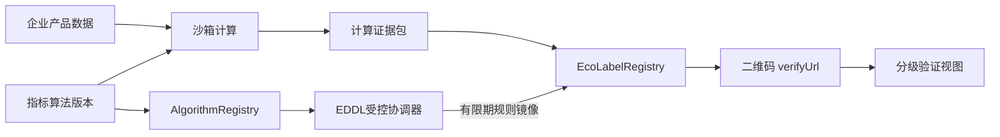

# 生态设计数字标识可信计算 MVP

本 MVP
将企业原始产品数据限制在沙箱侧，将区块链用于算法治理、计算证据承诺和标识生命周期，而不是将商业数据上链。

## 安全边界

- `ProductData.attributes`、敏感字段、材料和证明文件均保留在沙箱存储；`LedgerPort`
  的类型不接受这些内容。
- 链上登记规则/评价器哈希和状态，以及
  `inputHash`、`resultHash`、`evidenceHash`、`authorizationHash`、`proofHash`
  和标识状态；没有原始数据或中间值。
- `LocalDeterministicSandbox` 是离线开发和测试实现，明确不是
  TEE。生产环境应换成经过批准的 `TcsSandboxAdapter`
  结果映射实现，并可填入远程证明引用。
- `AntChainLedgerAdapter` 定义了真实调用边界和
  ABI，但不会假称合约已部署。部署时设置 `ECO_ALGORITHM_REGISTRY_CONTRACT` 与
  `ECO_LABEL_REGISTRY_CONTRACT`，并确认 ABI。当前通用适配器尚未实现 CompatV2
  所需的稳定区块快照、规则镜像同步和签发前后双读，真实研究链闭环只由受控 live
  runner 完成。

默认的 `LocalDeterministicSandbox` 与 `MemoryLedgerAdapter`
仅允许开发/测试。`main` 在 `ENV=production`
时会拒绝用这组默认适配器启动。生产组装必须显式构造
`EcoLabelService(approvedTcsSandbox, deployedAntChainLedger, publicBaseUrl)`，将其传给
`createApp(service, { viewerResolver })`，并提供已验证的 IAM/gateway
resolver；启动编排也应将真实合约名称、TCS 结果 mapper 和回执确认 mapper
设为必填配置。

## 身份与数据查看授权

`/api/eco` 不再信任客户端自报的 `x-viewer-role` 或
`x-enterprise-id`。生产部署必须向 `createApp` 注入 `ViewerResolver`，由 API
网关、企业 IAM、mTLS 身份或已验证 JWT claims 生成
`ViewerContext`。至少传入：主体 ID、角色、企业自身 `enterpriseId`
和合作方可访问的
`authorizedEnterpriseIds`。令牌验签、受众、过期时间和租户隔离必须在 resolver
之前或其中完成。

没有 resolver 时，只有公开验证
API/页面可访问；所有非公开操作都会拒绝，绝不会降级为请求头身份。`DevHeaderViewerResolver`
只用于本地手工测试，且只有 `ENV` 不是 `production` 并显式设置
`ECO_ALLOW_DEV_HEADERS=true` 时服务器才启用。合作方必须在可信 claims
中拥有目标企业的 `authorizedEnterpriseIds`
范围，才能读取分项指标；不能凭角色读取任意企业结果。

## 合约业务语义

`AlgorithmRegistry`：登记 scheme、版本、规则摘要和评价器摘要，管理
`DRAFT/ACTIVE/SUSPENDED/RETIRED`，并为受控协调器提供可独立读回的活动版本查询。
链上登记值来自 EDDL 生成的机读发布清单：模板包 `bundleDigest` 是规则摘要，模板包
声明的评价器 `artifactDigest` 是评价器摘要。算法 scheme
`eco-design-digital-identifier` 与数据使用 purpose `eco-design-labelling` 分开管理。

`EcoLabelRegistry`：固定并公开读回所使用的 AlgorithmRegistry 合约身份，核验有限期
规则镜像和五类承诺，保证 task/label 双唯一，管理签发、暂停、恢复、撤销、到期和
换版。标识记录同时保存签发所使用的 `algorithmSourceStateHash` 和来源区块高度。
外部验证必须同时核对绑定身份、AlgorithmRegistry 链上代码摘要、活动算法状态、
镜像来源和有效期。完整 ABI 见
[`contracts/eco-label/interface.md`](../contracts/eco-label/interface.md)。

这里的镜像是目标链兼容措施，不是跨合约证明。目标研究链的 Myfish
`BaseContract.callContract` 返回 code `1`，所以受权协调器在稳定区块窗口内双读规则
状态，冻结区块高度、哈希、时间和完整读回后，由 `ALGORITHM_MIRROR_ADMIN` 写入
EcoLabelRegistry。镜像 TTL 最长24小时；规则被暂停或换版后，在同步器更新镜像或旧
镜像到期前存在陈旧窗口。生产需要缩短 TTL、分离镜像管理员与签发者、监控规则状态
并立即同步；要求原子保证时仍需修复跨合约能力或采用另行评审的单合约方案。

内存适配器只用于测试，交易 ID 不代表真实链上交易。当前 AntChain
适配器在未提供部署专用回执映射时返回明确标为 `pending-request-*`
的请求引用，不能作为已确认交易证明。

### 已编译合约与真实研究链边界

仓库现已包含两份真实 Myfish/AssemblyScript 源码以及编译器生成的 ABI/WASC
工件，并已在目标研究链完成 AlgorithmRegistry 部署、初始化、规则登记和启用。
CompatV2 又完成了规则镜像与合成标识写入：来源规则状态锚定在区块15318726，镜像
同步状态位于区块15318740，合成标识状态位于区块15318756。`getLabel` 与
`getLabelByTaskId` 双读一致且均为 `ACTIVE`，签发前后的 AlgorithmRegistry 读回也
一致，两份合约链上代码与冻结 WASC 摘要相符。

这仍不是“终局交易证据闭环”。目标网关对上述已入块、可独立读回的状态持续返回
`txFinish=false/txSuccess=false`，证据状态为
`INCOMPLETE_TRANSACTION_EVIDENCE`，且没有 `completedAt`。因此可以声明真实链上
标识状态已经形成并被独立读回，不能声明网关已确认全部写操作终局成功。

CompatV1 的规则镜像已经成功，但标签记录把含有多个 `|` 的完整 payload 再嵌入
`|` 分隔记录，读回时字段数量不一致，签发以 code `10201` 失败且未生成标识。
CompatV2 改为逐字段幂等校验并移除嵌套 payload。V1–V5 的跨合约诊断版本和
CompatV1 均只作为失败证据保留，不用于业务签发。

| 合约                | 状态与数据                                                                                                                | 方法、权限和幂等约束                                                                                                                                    | 事件                                                                                                       |
| ------------------- | ------------------------------------------------------------------------------------------------------------------------- | ------------------------------------------------------------------------------------------------------------------------------------------------------- | ---------------------------------------------------------------------------------------------------------- |
| `AlgorithmRegistry` | scheme、版本、规则/评价器摘要、`DRAFT/ACTIVE/SUSPENDED/RETIRED`、发布者和时间                                             | 仅 `ALGORITHM_ADMIN` 可登记或改状态；ID+完整 payload 幂等；不同 payload 冲突；同一 scheme 仅一个 `ACTIVE`；支持原子换版                                 | `AlgorithmRegistered`、`AlgorithmStatusChanged`、`AlgorithmReplaced`及角色审计                             |
| `EcoLabelRegistry`  | 规则镜像、来源状态摘要/区块/有效期；label/task/algorithm、五类摘要、标识状态、签发者和时间                                | 仅镜像管理员可同步规则；仅签发者可签发；镜像必须 `ACTIVE` 且未过期；label/task 双唯一；逐字段幂等；生命周期终局不可逆 | `AlgorithmStateMirrored`、`LabelIssued`、`LabelRevoked`、`LabelStatusChanged`、`LabelSuperseded`及角色审计 |

不得将产品属性、配方、企业证明文件、明文中间分数、个人信息写入事件或状态。链上只接收上述哈希承诺和非敏感标识符。合约还应保存角色授予/撤销审计事件，所有方法校验调用者组织、租户和参数长度/哈希格式。

部署验收清单：

1. 由多组织/多签管理员配置 `ALGORITHM_ADMIN`、`ALGORITHM_MIRROR_ADMIN`、
   `LABEL_ISSUER`、`LABEL_LIFECYCLE_ADMIN`，分离同步者和签发者，并测试未授权调用
   回滚。
2. 用链上事件和查询分别验证算法登记、启停、镜像同步、陈旧来源区块、同区块冲突、
   镜像到期、签发、重复签发、撤销、重复撤销和跨租户越权。
3. 从真实交易回执提取交易哈希与区块高度，配置适配器回执 mapper；`PENDING`
   不得显示为链上已确认。
4. 比对链上 `inputHash`、`resultHash`、`evidenceHash`、授权和计算证明摘要
   与沙箱证据包；验证事件中没有原始产品字段。
5. 调用 `getAlgorithmRegistryContractId()`，并独立核对绑定身份、规则注册表链上
   WASC 摘要、活动算法 ID、算法摘要、镜像来源状态摘要和来源区块；签发前后双读
   AlgorithmRegistry。
6. 对升级、暂停、证书轮换和灾备恢复执行演练，保留旧标识的可验证历史。
7. 在正式业务适配器完成规则快照和镜像协调之前，不得把普通 HTTP/API 签发流程连接
   到 CompatV2 合约。

冻结模拟场景的当前一致率为37/37（100%），其中关键安全场景26/26（100%）。这是
确定性规则模拟器相对冻结 Oracle 的执行一致率，不是生态设计评级科学准确率，也不是
真实链场景通过率。CompatV2 目前只有一个合成正向签发样例完成链上状态读回，不进入
37项准确率统计；真实链全场景验收仍需取得可接受的终局回执和事件证据。

## HTTP 流程

所有响应为 `{ success, data }`。生产写操作需要可信 `ViewerResolver` 的身份
claims；企业提交时 claims 的 `enterpriseId` 必须与产品 `enterpriseId` 一致。以下
`x-*` 头仅适用于显式启用的本地开发适配器，不能用于生产认证。

1. `POST /api/eco/algorithms`（`admin`/`evaluator`）创建算法。
2. `PATCH /api/eco/algorithms/:id/status`，body `{"status":"ACTIVE"}` 启用算法。
3. `POST /api/eco/evaluations`（`enterprise`/`evaluator`/`admin`）提交
   `{ algorithmId, product }`。
4. `POST /api/eco/evaluations/:taskId/execute`（`evaluator`/`admin`）执行受控计算。
5. `POST /api/eco/evaluations/:taskId/issue`（`evaluator`/`admin`）提交签发；首次状态为
   `PENDING_CHAIN`，不是已签发。
6. `POST /api/eco/labels/:labelId/reconcile`（`evaluator`/`admin`）对账终局回执；只有通过严格核验才转为
   `ACTIVE`。
7. `GET /api/eco/labels/:labelId` 根据 `x-viewer-role` 过滤字段；`public`
   仅返回公开投影。
8. `GET /verify/:labelId` 是二维码可指向的公开 HTML
   页；`GET /api/eco/verify/:labelId` 返回同一公开 JSON。

上述 HTTP 流程描述的是服务层状态机，不代表 CompatV2 镜像协调已经接入。目前
`AntChainLedgerAdapter` 不会自动构造稳定区块快照或调用 `syncAlgorithmState`；直接
改写合约名称不能获得 live runner 的同等安全检查。

二维码可使用返回的 `qrPayload`，其中只包含
`labelId`、`verifyUrl`、链名/合约/交易 ID，不包含企业数据。

公开验证页展示标识状态、算法版本、沙箱证据摘要、链上存证状态以及输入/算法/结果/证据四项承诺校验，并单列“链上已确认”；分数、等级和分项结果只返回申请企业。本地
memory ledger 会明确标记为演示；AntChain 的 `PENDING`
请求不会通过链上确认。它证明记录和版本关联；不能单独证明企业最初提交的数据客观真实，仍需来源证明、抽检或第三方审核。
